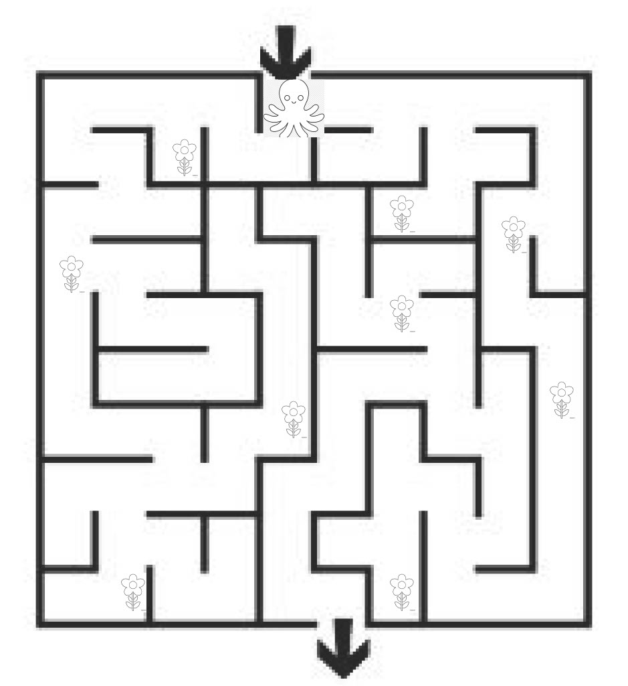

:warning: Everything between << >> needs to be replaced (remove << >> after replacing)

# Escape-o-pus
## CS110 Final Project  Fall Semester, 2024

## Team Members

Matthew Simmons

***

## Project Description

A little octopus guy will make his way around a maze/jail collecting flowers for his wife. He can leave the maze at any time. After he escapes the maze he will be greeted by his wife and a you win screen as well as the score, and highscore. 

***    

## GUI Design

### Initial Design

### Final Design

## Program Design

### Features

1. start menu
2. moveable octopus
3. walls that collide with the octopus
4. flower objects that are counted and disappear when touched by the octopus
5. gameover screen

### Classes

- Controller:
    Creates the controller object that handles all the required actions for the game

- Flower:
    Creates a flower object that is used to increase the players score

- Maze:
    Creates a Maze object which the player navigates and eventuyally escapes from. 

- Octopus: 
    Creates the player character/ octopus which is moved around the maze. 

## ATP

Test Case 1: Start Menu
Description: Verify that the start menu works as expected
1. Start the game
2. Verify that the start menu dissapears from the screen
Expected Outcome: Start menu is closed and game screen is visible

Test Case 2: Player Movement
Description: Verify that the player can move in the four arrow key directions
1. Start the game
2. Press the left arrow key
3. Verify that the player moves left
4. Press the right arrow key
5. Verify that the player moves right
6. Press the up arrow key
7. Verify that the player moves up
8. Press the down arrow key
9. Verify that the player moves down
Expected Outcome: The player moves left, right, up, and down

Test Case 3: Collision Detection
Description: Ensure that the collisions between the player and the walls are correctly detected
1. Start the game
2. Move the player in the direction of a wall
3. Verify that the player does not move
Expected Outcome: The player should not move from its position

Test Case 4: Flower Pickup
Description: Verify that the player can pick up the flowers around the game map
1. Start the game
2. Move the player into a flower
3. Verify that the flower dissapears
Expected Outcome: The player will move into the same position as the flower and the flower will disappear

Test Case 5: Score
Description: Verify that when a flower is picked up the flower count is increased by one
1. Start the game
2. Move the player into a flower
3. Verify that the Score increased by one-hundred
Expected Outcome: Score will increase by one-hundred

Test Case 7: Win condition
Description: Verify that if the Plaer escapes the maze the game ends and a you win screen is displayed
1. Start the game
2. Move the player to the exit of the maze and exit
3. Verify that the game won screen apears
4. Verify that the game returns to the menu
Expected Outcome: The game should display a game won message and return to the main menu

Test Case 8: High Score 
Description: verify that the high score is displayed everytime the game ends, and changes when the player acheives a score higher than the current high score, to that new score
1. Start the game
2. Move the player to the exit of the maze and exit, but avoid as many flowers as possible
3. Verify that the game ends and the score acheived is displayed along with the current high score
4. Return to the menu
5. Start the game
6. Move the player to the exit of the maze and exit, while collecting as many flowers as possible
7. Verify that the game ends and the score acheived is displayed along with the new high score
Expected Outcome: The score and high score are displayed and change when necessary